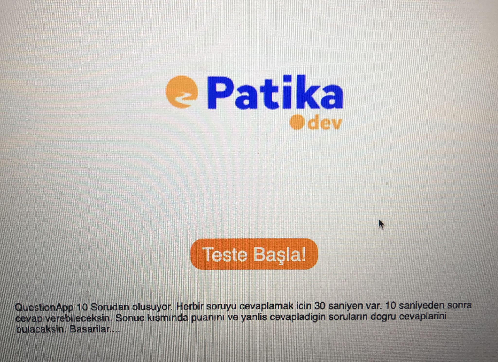

                QUESTİON APP REACT/FRONT END BİTİRME PROJESİ

[Question app] (https://questionapp-anilbasaran.netlify.app/)

Projenin tasarımı tamamen size ait olacak (1400px ölçüsünde okunabilir ve kullanılabilir olmalı)

Projenin giriş ekranında "Teste Başla" adında bir buton bulunmalı ve test hakkında bilgilendirme paylaşılmalı.

Buton "id"'si "start" olmalıdır.

Çalışma 10 sorudan oluşmaktadır ve paylaşılan dökümanda bulunmaktadır. (Resimleri Kullanmayı Unutmayın)

Her soru ekranda en fazla 30sn kalmalıdır.

İlk 10sn cevap şıkları görünmeyecektir.

Cevap şıklarından biri tıklandıktan ya da 30sn tamamlandıktan sonra yeni soruya geçilecektir.

Geçmiş sorulara dönülemeyecektir.

Test bitiminde her soruya verilen yanıt ile doğru ve yanlış sayıları kullanıcı ile paylaşılacaktır.

Deploy

Proje Readme dosyasında Canlı Site linki bulunmalı. (Netlify ya da Vercel kullanabilirsiniz)
